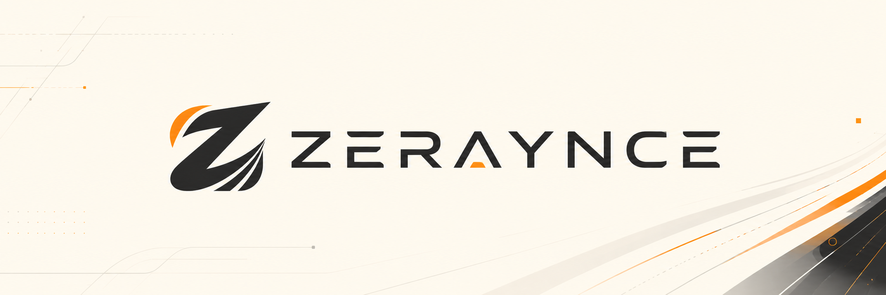

<p align="center">
  
</p>

<h1 align="center">Zeraynce</h1>

<p align="center">
  <strong>A software engine studio building practical digital systems for focused teams.</strong>
</p>

<p align="center">
  
  
  
  
</p>

<p align="center">
  <a href="https://zeraynce.com">Website</a>
  ·
  <a href="mailto:zeraynce@gmail.com">Contact</a>
  ·
  <a href="https://github.com/zeraynce-studio">GitHub</a>
</p>

---

## About Zeraynce

Zeraynce designs and develops clean, structured, and scalable software for creative platforms, business workflows, internal tools, and operational systems.

We focus on clarity, maintainability, security, clean design, and long-term product thinking.

We do not build noisy software.  
We build practical systems that teams can trust, operate, and improve over time.

---

## Operating Model

```text
Zeraynce
   │
   ├── Product Strategy
   │      └── Define the real workflow, business rules, and long-term direction.
   │
   ├── Design System
   │      └── Build calm, clear, and consistent interfaces.
   │
   ├── Engineering
   │      └── Develop maintainable, secure, and scalable systems.
   │
   ├── Operations
   │      └── Support monitoring, documentation, releases, and internal control.
   │
   └── Products
          └── Atelier — Creative management platform.
```

---

## Current Product

<table>
  <tr>
    <td width="30%">
      <h3>Atelier</h3>
      <p><strong>Creative Management Platform</strong></p>
      <p>Status: Active Development</p>
    </td>
    <td width="70%">
      <p>
        Atelier is Zeraynce's current flagship product. It is a creative management platform for photographers, videographers, studios, organizers, designers, event suppliers, and creative professionals.
      </p>
      <p>
        Atelier helps creative teams manage public profiles, private booking inquiries, confirmed projects, media organization, and client-facing workspaces from discovery to delivery.
      </p>
    </td>
  </tr>
</table>

---

## Atelier Helps Teams

| Area | Purpose |
|---|---|
| Public Profiles | Build trusted creative profiles that clients can discover. |
| Private Inquiries | Receive structured booking requests without public clutter. |
| Bookings | Manage confirmed creative work, schedules, and project status. |
| Media Workspace | Organize project folders, review files, and delivery assets. |
| Client Workspace | Give clients a clear place to view their requests and projects. |
| Admin Operations | Support future monitoring, role management, and product control workflows. |

---

## What We Build

<table>
  <tr>
    <td width="50%">
      <h3>Creative Platforms</h3>
      <p>Systems for studios, suppliers, and service-based creative professionals.</p>
    </td>
    <td width="50%">
      <h3>Business Workflow Systems</h3>
      <p>Tools that replace scattered spreadsheets, manual tracking, and fragile processes.</p>
    </td>
  </tr>
  <tr>
    <td width="50%">
      <h3>Internal Dashboards</h3>
      <p>Admin panels, monitoring tools, operational consoles, and management systems.</p>
    </td>
    <td width="50%">
      <h3>Booking Systems</h3>
      <p>Inquiry, approval, scheduling, project tracking, and client handoff flows.</p>
    </td>
  </tr>
  <tr>
    <td width="50%">
      <h3>Media & File Systems</h3>
      <p>Structured project folders, file organization, and delivery-ready workspaces.</p>
    </td>
    <td width="50%">
      <h3>Automation-Ready Tools</h3>
      <p>Background jobs, notifications, sync workflows, and operational triggers.</p>
    </td>
  </tr>
</table>

---

## How We Build

```text
Discover → Design → Build → Test → Improve
```

| Step | Meaning |
|---|---|
| Discover | Understand the real workflow, users, pain points, and business rules. |
| Design | Plan clean interfaces, data flow, permissions, and long-term structure. |
| Build | Develop practical features with maintainable architecture and clear boundaries. |
| Test | Validate behavior, access control, UI quality, build output, and edge cases. |
| Improve | Refine the product through QA, feedback, documentation, and iteration. |

---

## Engineering Principles

| No. | Principle | Standard |
|---|---|---|
| 01 | Clarity before complexity | Readable systems are easier to operate, review, and improve. |
| 02 | Systems before shortcuts | Every feature should fit the larger product architecture. |
| 03 | Design with restraint | Interfaces should feel calm, focused, and intentional. |
| 04 | Build for maintainability | Future developers should understand the code without guessing. |
| 05 | Ship with discipline | Testing, review, documentation, and clean commits matter. |
| 06 | Trust is part of the product | Security, privacy, and access control are product requirements. |
| 07 | Documentation is part of the work | A task is not complete if the related documentation is outdated. |
| 08 | Do not fake maturity | Build honestly, improve consistently, and avoid unnecessary complexity. |

---

## Team

| Name | Role |
|---|---|
| Arjay Escabas | Founder |
| Aliazer Casan Solaiman | Team Member |
| Prince Aironn Corasa | Team Member |
| John Ghlen Dealdo | Team Member |
| Cris John Labiaga | Team Member |
| Japhet Kundiman | Team Member |

---

## Development Workflow

Zeraynce follows a disciplined GitFlow workflow.

```text
main        → stable, production-ready code
develop     → team checkpoint and integration branch
feat/*      → new features
fix/*       → bug fixes
refactor/*  → code improvements without feature changes
docs/*      → documentation-only updates
chore/*     → maintenance and setup tasks
release/*   → release preparation
hotfix/*    → urgent production fixes
```

## Workflow Rules

| Rule | Standard |
|---|---|
| No direct push to `main` | All changes must go through Pull Requests. |
| Start from `develop` | Always update local code before creating a task branch. |
| Use correct branch type | Use `feat`, `fix`, `refactor`, `docs`, `chore`, `release`, or `hotfix`. |
| Stage specific files only | Do not stage unrelated files or random formatting changes. |
| Test before pushing | Run local checks before creating a Pull Request. |
| Update documentation | Docs must change when setup, workflow, API, database, infrastructure, or behavior changes. |

---

## Repository Standards

Each Zeraynce repository should include:

| Standard | Requirement |
|---|---|
| Project documentation | Clear explanation of the project purpose and structure. |
| Environment examples | Safe `.env.example` files without secrets. |
| Setup guide | Local development and run instructions. |
| Testing guide | Build, lint, and QA instructions when available. |
| Secret handling | No credentials, tokens, private keys, or sensitive server data in public files. |

---

<details>
  <summary><strong>Current Focus</strong></summary>

<br />

Zeraynce is currently focused on developing and stabilizing Atelier as its first major product.

Primary priorities:

- Product polish
- Staging readiness
- Clean GitFlow workflow
- Role-based access control
- Dashboard and monitoring architecture
- Documentation discipline
- Secure deployment preparation
- Long-term maintainability

</details>

<details>
  <summary><strong>Public Repository Safety</strong></summary>

<br />

Public repositories should never expose:

- API keys
- Database URLs
- Service-role credentials
- Server IPs used for private infrastructure
- Private deployment notes
- Internal-only architecture diagrams
- Production secrets
- Customer or user data

</details>

---

<p align="center">
  <strong>Systems built with quiet ambition.</strong>
</p>
